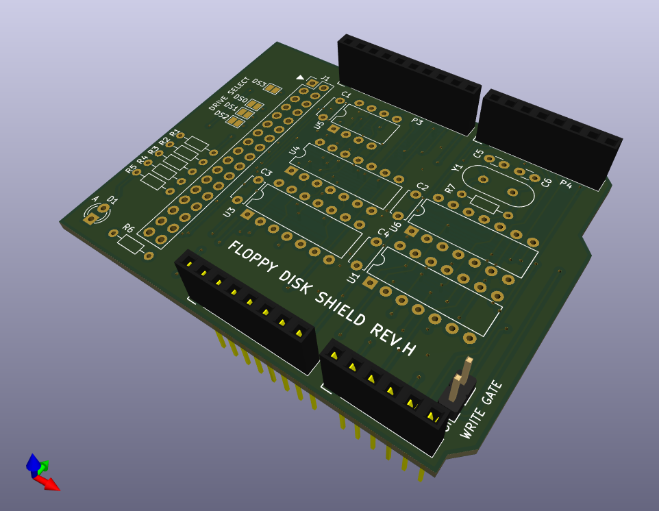
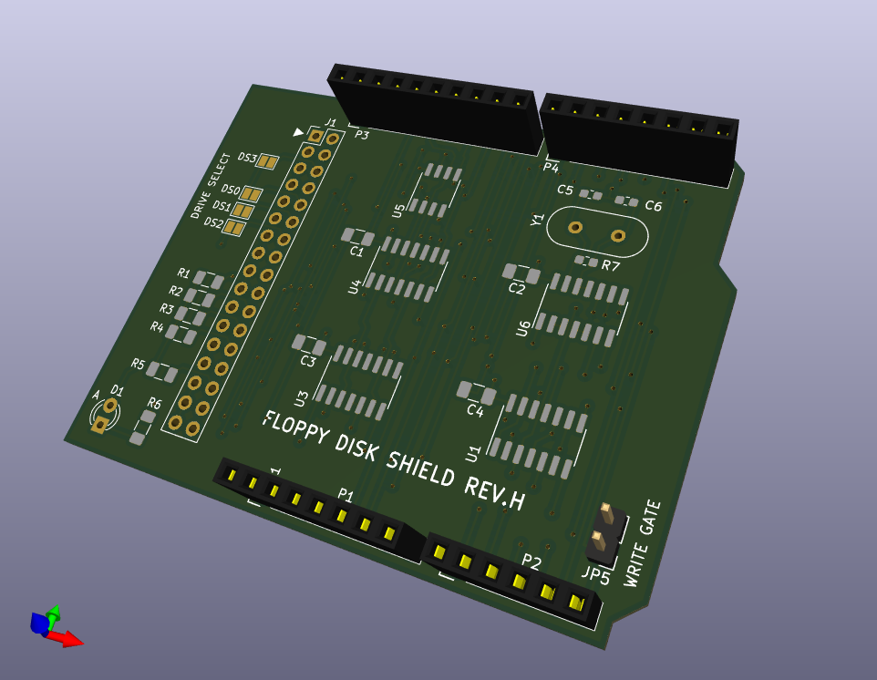
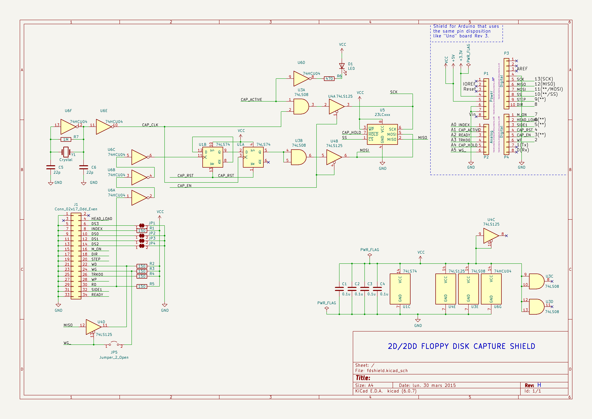

# Floppy Disk Shield for Arduino UNO

## Caveat and Disclaimer - Read before you build a fd-shield  

- I don't own any responsibility for the data loss or physical damage on your floppy disks or computer assets caused by the use of hardware and software included in this project.
- Hardware compatibility (especially, FDD and FD-Shield compatibility) is not guaranteed. Your FDD may now work with the FD-Shield.  
- The magnetic flux power on the old floppy disks are dropping and getting weak as time passes. Read-out data integrity with this system is not guaranteed.
- Recommended to use newer FDD. The old FDD may have problems on the magnetic head such as contamination, worn out or mechanical misalignment.

## Announcement  
23-Sep 2022 : Preview release - Feature to write back the floppy images to FD is supported. Use `duplicate.py` to write the `*.raw` floppy image data to a floopy disk. Arduino firmware update and closing `JP5` on the fd-capture shield are required to enable the feature.   
23-Sep 2022 : Preview release - イメージの書き戻しもできるようになりました。Arduinoファームウエアの更新と`JP5`ジャンパーのショートをすると書き込みができるようになります。   

## Description
This is a project to develop a system for preserving old 2D/2DD floppy disk data.  
The system can preserve entire floppy disk data regardless whether it's normal or not. That means the system can read and preserve copy protect information in the bit-stream file as it is.  
The recorded bit-stream file can be decoded and restore the contents anytime later.  
The system includes a bit-stream data to D77/D88 emulator disk image converter. You can read the floppy disk with this tool and generate the disk images.  
これは古い2D/2DDフロッピーディスクのデータを保存するためのシステムを作るプロジェクトです。  
このシステムを使うことで仕様にのっとった正しい信号も非正規の信号も全てそのまま保存することが可能です。つまり、このシステムではコピープロテクトのための情報まで含めてビットストリームデータとして保存することが可能です。  
記録されたビットストリームデータは後でデコード、解読を行うことで情報を取り出すことが可能です。  
このシステムにはビットストリームデータからエミュレータ互換のイメージファイル(D77/D88)を生成するためのコンバーターも含んでいます。実際のフロッピーを読み取り、ディスクイメージを生成することが可能です。  

The system consists of the hardware and software:  
システムはハードウエアとソフトウエアから構成されます:

**Hardware**  
|Item|Description|
|:----|:----|
|Arduino UNO|Arduino UNO. The firmware uses ATMega328 specific regiter. The other Arduino board may not work|
|Floppy disk shield for Arduino|Design data is included. Both schematics and PCB data are available (`./kicad/*`)<br>Rev.A design has bugs. Rev.B and beyond are basically comatible and has same function.<br>KiCAD用のPCBの設計データも提供されています(./kicad/*)<br>Rev.A and Rev.Fにはバグがあります。Rev.B以降は基本的に同じ機能です|
|Floppy disk drive|2D/2DD/2HD FDD. 3.5" or 5.25" FDD (+ power supply and ribbon cable). 300rpm drive is recommended but 360rpm 2HD drive will work as a 2DD drive. The FD-shield can detect the track density (2D or 2DD/2HD, 80 tracks or 160 tracks) and spindle spin speed (300rpm or 360rpm)|  

**Software**  

|Name|Description|
|:--------|:-----------|
|[`fdcapture.ino`](./docs/fdcapture_ino.md)|Arduino firmware (sketch) for the floppy shield<br> (`./fdcapture/fdcapture.ino`)|
|[`capture.py`](./docs/capture.md)|Floppy image capture tool (FD->image).<br>Transfers raw bitstream data from Arduino to a PC (foremerly, `transfer.py`)|
|[`duplicate.py`](./docs/duplicate.md)|Floppy image write back tool (image->FD).<br>Transfers raw bitstream data from a PC to Arduino. Close '`JP5`' jumper pad on the FD capture shield to enable the write feature.|
|[`bs2d77.py`](./docs/bs2d77.md)|Bit-stream data (.raw) to emulator disk image (D77/D88) converter.<br> The program generates modified D77 image data (D77mod). D77mod specification is [here](docs/D77mod_format.md). The D77mod uses some reserved bytes in the header but it is designed to keep backward compatibility with the standard D77 disk images. The D77mod image should work with emulators which supports regular D77/D88 disk images.|
|[`bs2hfe`](./docs/bs2hfe.md)|Bit-stream data (.raw) to .HFE floppy image format.<br>The .hfe disk image format is used for the [HxC FDD emulator device](https://hxc2001.com/download/floppy_drive_emulator/).|
|[`bs_inspect.py`](./docs/bs_inspect.md)|Data inspection/analyze tool for bit-stream data|
|[`d77_inspect.py`](./docs/d77_inspect.md)|Data inspection/analyze tool for D77/D88 disk image data|
|`floppylib.py`|A library which provides fundamental floppy disk functions.<br> This library is including data-separator, digital VFO, MFM decoder and IBM format parser|
|`d77dec.py`|Convert a D77/D88 disk image data to a JSON (plane text) file|
|`d77enc.py`|Generate a D77/D88 disk image data from a JSON file|
|`d77lib.py`|A libray which provides basic D77/D88 floppy disk image manipulation functions|
|[`kfx2bs.py`](./docs/kfx2bs.md)|[**KyroFlux**](https://www.kryoflux.com/) raw-bitstream data to fd-shield bit-stream data converter. You can capture FD image with KryoFlux and use it.|

### Updates  
|Date|Description|
|-|-|
|Sep 2022|Updated PCB design. Changed the 'Write Gate' jumper from jumper pad to jumper pin header for easy setting.|
|Sep 2022|Added support for the image write back feature (image->fd). Arduino firmware update and closing `JP5` on the fd-capture shield are required to enable the feature.|
|Sep 2022|Added RAW to HFE file converter (bs2hfe.py)|
|Aug 2022|Backported data-separator and VFO algorithm from [fdc_bitstream](https://github.com/yas-sim/fdc_bitstream) project. The latest VFO algorithm improved the accuracy of the data reading / decoding.|

## fdc_bitstream  
The [`fdc_bitstream`](https://github.com/yas-sim/fdc_bitstream) is my project that provides a bit-accurate C++ software FDC library. The fdc_bitstream project includes a disk image converter and image analyzer. Those software are written in C++, so they are faster than the converters in this project. Also, they are developed recently and have better algorithms for format conversion.  Please try `image_converter` in the `fdc_bitstream` project as well.  
[`fdc_bitstream`](https://github.com/yas-sim/fdc_bitstream)はビット精度で正確なソフトウエアFDCを開発するプロジェクトです。fdc_bitstreamプロジェクトにもイメージ変換ツールとイメージ解析ツールが含まれています。これらのツールはC++でかかれており、より高速です。またこちらのほうが開発が後なのでより良いアルゴリズムが使われており、イメージ変換の正確性も上がっています。fdc_bitstreamプロジェクトのimage_converterもお試しください。  

### System Diagram


## FD-Shield - How It Works


---------

## Introduction of Features in the Support Tools

* `bs_inspect.py`  
This tool provides featurs to analyze or check the bitstream data and its quality.  
  * Visualize data timing history
  * Visualize data timing histogram
  * Read all IDs in the tracks
  * Read all sectors in the tracks
  * MFM data dump
  * ASCII data dump (display pritable/readable data)
  * Tweak parameters (VFO high/low gain value, sampling frequency, FDD spin speed) 

### Bitstream visualizer  
You can check how VFO follows the variation of pulse pitch with the bitstream visualizer.  
The VFO tries to keep the data pulse be the center of the bit cell as much as possible by tweaking the oscillation frequency (= the bit cell width).  

  

### Bitstream timing histogram viewer
* Good case 
* Bad case - Usually, this may be caused by the spindle speed fluctuation (that causes data pulse pitch variation in a track), or data written by multiple drives (written with drives with different spindle motor speeds).  

  
### Pulse (bit) pitch visualizer  
You can check the pulse pitch fluctuation throughout a track with the pulse pitch visualizer. The stabler pitch, the easier MFM decode or data read.  
- Stable pitch  

- Unstable pitch. Heavily fluctuated. It's so hard to follow by the VFO. May fail data retrieving.  


---------

## How to use (Image capture) - 使い方

1. Build Floppy shield for Arduino UNO - シールド製作  
- PCB design files can be found in the `./kicad` directory
2. Burn the floppy disk shield firmware (sketch) to Arduino UNO - Arduio UNOにファームウエアを書き込む  
Use `fdcapture.ino`
3. Assemble the system - システムを接続
- Attach a floppy shield to an Arduino UNO
- Connect a floppy shield and a floppy disk drive with a 36pin ribon cable
- Connect Arduino UNO to PC via USB cable
4. Read raw bit-stream data from a floppy disk - フロッピーからビットストリームデータを生成  
- Insert a 2D floppy disk to the floppy disk drive (FDD)
- Run following command on the Windows PC:
```sh
python capture.py -o image_name.raw --read_overlap 5 [--media_type 2D|2DD]
```
- `capture.py` will search COM port for Arduino UNO and use it.  
- `--read_overlap` option specifies how much data to read on the 2nd lap in percent.  
- `--media_type` option specifies the media type to read. `2D` or `2DD` are available.  
Note: The `fdcapture.ino` can identify the drive type (2D or 2DD) but not the media type.    
5. Convert raw bit-stream data into emulator image data (D77mod) -- ビットストリームからディスクイメージファイルを生成
```sh
python bs2d77.py -i image_name.raw --abort_id
```
- `image_name.d77` will be generated.  
**Note:** The `--abort_id` option enables abort reading track image when the same sector ID is detected. The FD-shield can read the top of the 2nd lap with `--read_overlap` option. This overlapped track data may contain the same sector data twice. This option will prevent from generating the same sector in a track.  

## Image write back (cloning)  
1. Setup the system as the same as image captureing.  
	- The same `fdcapture.ino` firmware works for both `capture.py' and 'duplicate.y' but updating to the latest firmware is required. Use Arduino IDE to update the firmware (Arduino program).    
	- Close `JP5` jumper pad on the fd-capture shield.  
2. Run '`duplicate.py`' to write back a '`*.raw`' floppy image to a floppy disk.  
```sh
python duplicate.py -i disk_image.raw
```

## How to make your own FD-shield PCB (FD-shield PCBの作り方)  
- PCB design data and the data for PCB manufacturing (Garber data and drill data) are included in this project. You can order your PCB at a PCB manufacturing service company. I used 'Fusion PCB' from Seeed Studio. (cost would be around $35 for 10 PCBs incl. delivery fee)    
- PCB設計データとPCB製造データ(ガーバー、ドリル)はこのプロジェクトに含まれています。PCB製造サービス会社に製造を依頼してPCBを手に入れることができます。私はSeeed StudioのFusion PCBを利用しました。(10枚で4K円くらい？ 送料込み)   

|File|Description|  
|---|---|  
|pcb_mfg_data/fdshield-dip-rev-h.zip|PCB manufacturing data. DIP version. Rev.H (Write Gate pin header)|  
|kicad/fdshield-dip/fdshield/fdshield.kicad_pro|KiCad v6 design file (DIP)|  
|kicad/fdshield-sop/fdshield/fdshield.kicad_pro|KiCad v6 design file (SOP)|  

## Accessory Tools  
1. FDD spindle motor speed calibration tool  
This tool measures the index hole to index hole time and show it on the screen. You can tweak a variable register on the FDD control board to adjust the spindle speed.  
**CAUTION**: There might be multiple variable registers on the FDD control board. If you are unsure which one is the right one, do not turn it, or your FDD will become unfunctional.  
- How to use:  
	1. Set up `fdcapture` shield - Connect Arduino UNO, fdcapture shield, and FDD.   
	2. Insert a floppy disk into the FDD.  
	3. Run `spindle_calibration_tool.py`

## Current Development Status
**Done:**
- Read floppy disk images (2D disk on 2D drive, 2DD disk on 2D deive, 2D disk on 2DD/2HD drive)
- Write floppy disk image to floppy disk (2D images are tested)  
- Drive type auto datection (2D or 2DD/2HD)
- Drive spindle revolution measurement 
- Generates D77mod disk images from the raw bitstream data (RAW->D77)
- RAW->HFE file converter
- Bit stream file quality inspection tool (bs_inspect.py)

## Test Environment

- Windows 10 1909 / Windows 11 21H2
- Arduino UNO
- Floppy disk shield for Arduino
- FDDs (table below)

|P/N|Mfg|FF|Description|
|:----|:----|:----:|:----|
|YD-580 1354|YE-Data|5.25"|2D, 300rpm, for Fujitsu FM-7|
|MD5201|Canon|5.25"|2D, 300rpm|
|FD-55B-01-U 19307110-01|TEAC|5.25"|2D, 300rpm|
|FD55-GFR 19307673-93|TEAC|5.25"|2DD/2HD, 360rpm, for DOS/V|
|YD625-1525|YE-Data|3.5"|2D, 300rpm, for Fujitsu FM-77|
|FD-235HG 19307773-04|TEAC|3.5"|2DD/2HD, 300/360rpm, Fixed to DS1|
|OSD E26J|Citizen|3.5"|2DD/2HD, 300/360rpm, for PX9821Xa?|
|JU-256A236P|Panasonic|3.5"|2DD/2HD, 300/360rpm, for DOS/V|
|FD1231T 134-506790-011-0|NEC|3.5"|2DD/2HD, 300/360rpm, for PC9821|
|DF354H068C|ALPS|3.5"|2DD/2HD, 300/360rpm, for DOS/V|

---------------

## Addendum


### FD-shield - 3D view
  
  
  

### FD-shield - Schematics  
Y1 (Xtal) = 4MHz X'tal.  
U6 must be '74HC**U**04' (unbuffered type). The standard '74HC04' doesn't work.  
The other logic ICs can be either one of '74LS' or '74HC'.  

[PDF](resources/fdshield-schematics.pdf)
